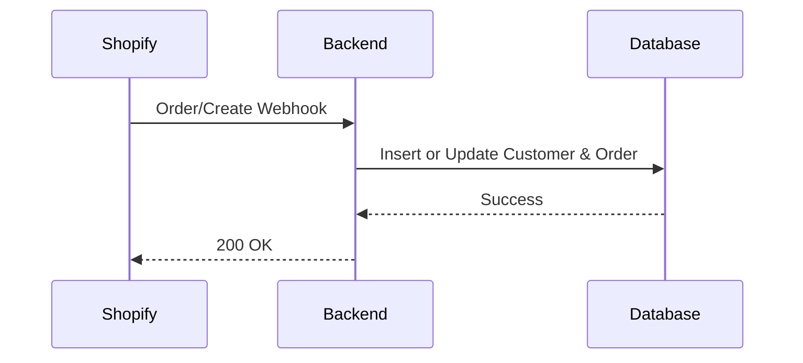
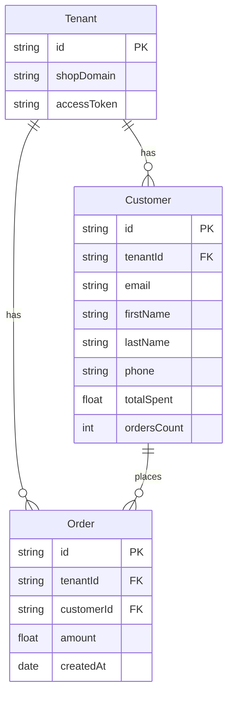
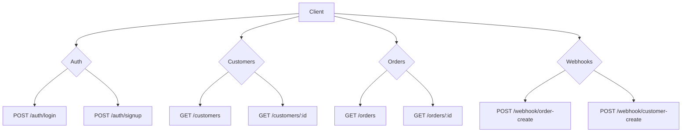

# 📦 Xeno CRM – Shopify Customer Relationship Manager

Xeno CRM is a full-stack platform built for Shopify merchants to manage customers, sync orders, segment audiences, and run targeted campaigns.  
It is designed with multi-tenant support, high performance, and scalable architecture.

## 🚀 Features
- 🔗 Shopify Webhook Integration (Orders, Customers)
- 👥 Multi-Store / Multi-Tenant Architecture
- 📊 Real-Time Data Sync
- 🎯 Audience Segmentation
- 📨 Campaign Builder
- 🔒 JWT Authentication & Role Management
- 📈 Analytics Dashboard

## 🏗️ System Architecture
```mermaid
graph TD
    A[Shopify Store] -->|Webhooks| B[Backend API (Node.js)]
    B --> C[(PostgreSQL)]
    B --> D[(Redis Cache)]
    E[React Admin Dashboard] --> B
    B --> F[Background Worker / Queue]
```

## 🛠️ Tech Stack
### Backend
- Node.js  
- Express.js  
- Prisma ORM  
- PostgreSQL  
- Redis  
- Shopify Admin API  
- JWT Auth  

### Frontend
- React.js  
- TailwindCSS  
- Recharts  

## 🔄 Shopify Sync Flow


## 🏬 Multi-Tenant Data Model


## 📡 API Overview


## 📁 Project Structure
```
xeno_project/
│
├── backend/
│   ├── src/
│   │   ├── controllers/
│   │   ├── services/
│   │   ├── middleware/
│   │   ├── prisma/
│   │   └── utils/
│   └── server.js
│
└── frontend/
    ├── src/
    ├── pages/
    ├── components/
    └── App.jsx
```

## ⚙️ Environment Variables
Create a `.env` in `/backend`:
```
DATABASE_URL=postgres://...
REDIS_URL=redis://...
SHOPIFY_API_KEY=...
SHOPIFY_API_SECRET=...
JWT_SECRET=...
```

## 🧪 How to Run
### Backend
```bash
cd backend
npm install
npm run dev
```
### Frontend
```bash
cd frontend
npm install
npm run dev
```

## 📬 Webhook Endpoints
| Event            | Endpoint                       |
|------------------|--------------------------------|
| Order Create     | /webhook/order-create          |
| Customer Create  | /webhook/customer-create       |

## 👤 Author
**Siddhant Vyas**  
Full-Stack Developer — Node.js | React | PostgreSQL | TailwindCSS  

## ⭐ Contribute / Feedback
PRs and feedback are welcome!
